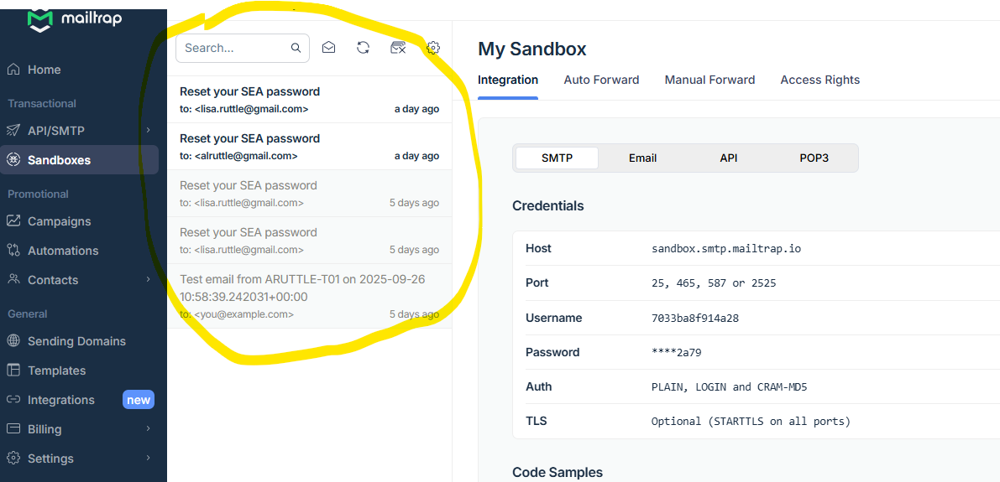
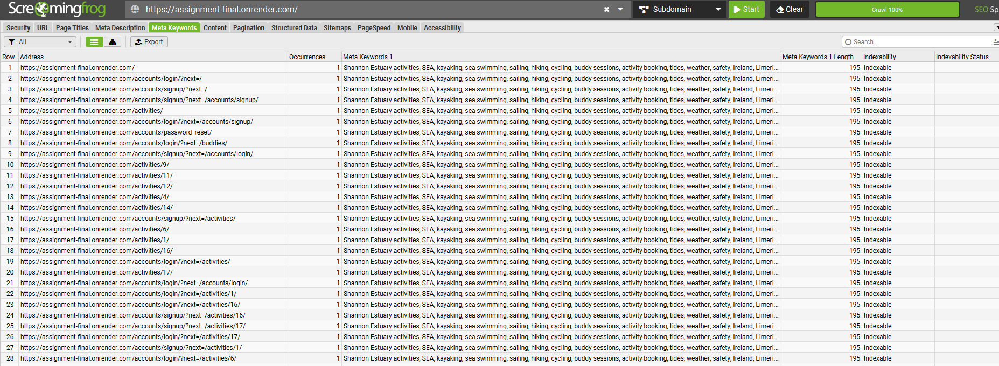
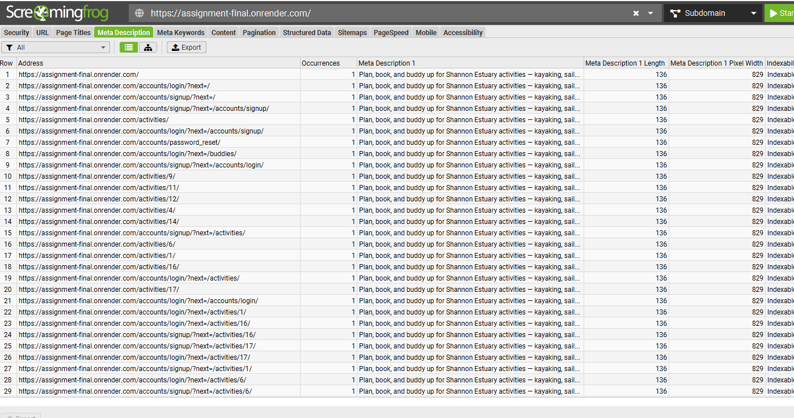
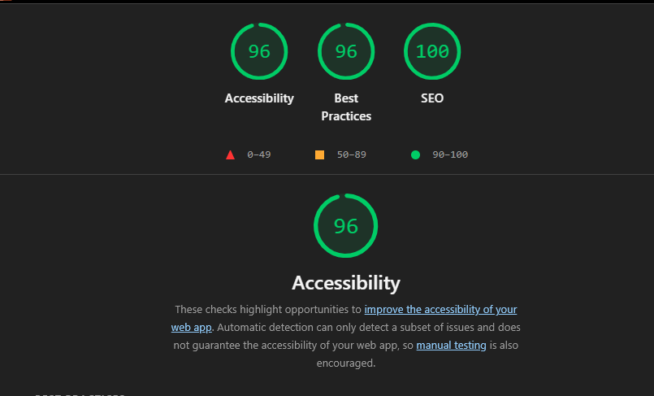
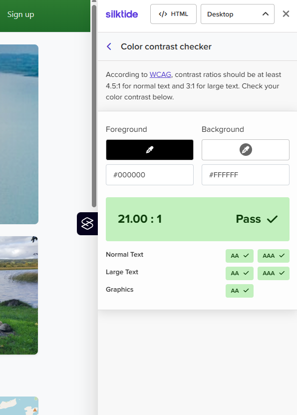

## Submission readme.md file
# SEA — Shannon Estuary Activities
Plan, book, and buddy up—safely.
SEA is a Django 5 app (HTMX/Bootstrap frontend) for discovering local activities and creating community buddy sessions. It integrates a weather/tide API, supports file uploads for activity cover images, and is deployed on Render.

Tech: Django 5 • HTMX • Bootstrap 5 • Leaflet • Flatpickr • Pillow (file uploads) • Cloudinary

## Features

 Activities

- Browse activities with search & provider filter.

- Date picking (Flatpickr) + HTMX to fetch same-day availability slots.

- Book a slot (capacity-aware, duplicate booking guarded).

- Cover images (admin upload) used for card backgrounds and detail page hero.

- Free / info-only activities: toggle “Requires booking” in Admin to hide the booking panel and show a friendly notice.

Buddy sessions

- Create/join sessions (Swim / Kayak / Hike / Cycle).

- Past sessions auto-hidden (only upcoming start_dt >= now are listed).

- Optional housekeeping command to archive/delete old sessions.

- Distance to session chip: uses the browser’s (opt-in) geolocation and a Haversine calc to display “X km away”.

- Type chips (quick filters) and search box.

- Messaging system

Safety panel

- Leaflet map with “Check Conditions” opens a safety drawer that fetches weather/tide from Stormglass.
Responses are cached to reduce API calls and handle rate limits.

UX polish

- Responsive layout, hero banners, modern cards, subtle shadows, and clean typography.

- Infinite scroll for Activities + Buddy lists (HTMX “revealed” trigger).
Degrades to ?page=N if JS is disabled.

- Consistent footer and nav, “Enable location” fallback button, and accessible semantics.

Auth + Dashboard

- Django auth with signup/login/logout.

- Dashboard with upcoming bookings, joined/hosting buddy sessions, and recent messages.

Email

- Works with SMTP (Mailtrap sandbox in dev).
Email settings are env-driven.

## Links and Login
Github-repo: URL:
    https://github.com/aruttle/assignment-final

Render: URL:
    https://assignment-final.onrender.com
    https://dashboard.render.com/web/srv-d39ck71r0fns738jhif0/events

Render: Assignment Admin page:
    https://assignment-final.onrender.com/admin/

Login Name: 
    'darkknight@gmail.com'

Login Password:
    'BatCav3!'

### Site Map

- Generated on https://octopus.do/

### Site Map Address 
**Core**

https://assignment-final.onrender.com/
 — Home

**Activities**

https://assignment-final.onrender.com/activities/
 — List 

https://assignment-final.onrender.com/activities/`
<id>`/ — Detail

https://assignment-final.onrender.com/activities/`
<id>`/availability/ — Slots 

https://assignment-final.onrender.com/activities/`
<id>`/book/ — Create booking 

https://assignment-final.onrender.com/activities/bookings/`
<id>`/cancel/ — Cancel booking 

https://assignment-final.onrender.com/me/bookings/
 — My bookings

**Buddies**

https://assignment-final.onrender.com/buddies/
 — List 

https://assignment-final.onrender.com/buddies/create/
 — Create session

https://assignment-final.onrender.com/buddies/`
 — Detail

https://assignment-final.onrender.com/buddies/`
 — Edit

https://assignment-final.onrender.com/buddies/`
— Delete 

https://assignment-final.onrender.com/buddies/`
 — Join/leave 

https://assignment-final.onrender.com/buddies/`
— Post message 

https://assignment-final.onrender.com/buddies/messages/`
— Delete message

https://assignment-final.onrender.com/buddies/my/
 — My sessions

**Safety**

https://assignment-final.onrender.com/safety/
 — Safety home

**Accounts & Auth**

https://assignment-final.onrender.com/accounts/login/

https://assignment-final.onrender.com/accounts/logout/

https://assignment-final.onrender.com/accounts/signup/

https://assignment-final.onrender.com/accounts/password_change/

https://assignment-final.onrender.com/accounts/password_change/done/

https://assignment-final.onrender.com/accounts/password_reset/

https://assignment-final.onrender.com/accounts/password_reset/done/

https://assignment-final.onrender.com/accounts/reset/`

https://assignment-final.onrender.com/accounts/reset/done/

https://assignment-final.onrender.com/me/
 — User dashboard

**Admin**

https://assignment-final.onrender.com/admin/

## Project structure (high-level)
activities/         # providers, activities, bookings (+ admin & views)  
buddies/            # buddy sessions, messages, join/leave  
accounts/           # signup/login + dashboard  
core/               # homepage, maps, common templates/static  
safety/             # safety drawer + Stormglass calls  
templates/          # site templates (Bootstrap 5)  
static/             # css/js/images (compiled & served via WhiteNoise/Render)  
media/              # uploaded files (local dev) or Cloudinary (prod)  

## Stack

Backend: Django 5, django-environ

Frontend: Bootstrap 5, HTMX, Flatpickr, Leaflet

DB: PostgreSQL (Render), SQLite for quick local dev

Uploads: Pillow + FileSystemStorage (local) or Cloudinary (Render)

Caching: Django locmem cache (Stormglass responses)

Email: SMTP (Mailtrap)

## Wireframes
### Click [here](./docs/wireframes.pdf)

## Planning Analysis Sheet
### Website goal
  Create the first unified hub for the Shannon Estuary that lets people discover, plan, and safely enjoy outdoor activities—combining provider listings and bookings with buddy sessions and an integrated tide & weather safety panel tailored to the estuary.

### Why it’s different

- Estuary-specific safety: Tide, wind and daylight guidance built for this coastline.

- Blends paid & free: Professional providers and community-run buddy sessions in one place.

- Mobile-first, local-first: Designed for on-the-go planning around local tide windows and micro-weather.

### Map and Safety Panel

[Link to view the image](./docs/map-safteypanel.png)

### Activities Page

[Link to view the image](./docs/activities.png)

### Activities Detail Page

[Link to view the image](./docs/activities-detail.png)

### Buddies Page

[Link to view the image](./docs/buddies.png)

### Buddies Detail Page

[Link to view the image](./docs/buddies-detail.png)

## Key user flows

 1) Sign-up / Login / Recovery
-----------------------------

*   **Create account** via /accounts/signup/ → auto-login on success.
    
*   **Login** via /accounts/login/ with polished layout and clear inline errors.
    
*   **Password reset** via Django’s built-ins (email through Mailtrap).

[Link to view the image](./docs/mailtrap-testing.png)
    
*   Redirects honor ?next=… so users return to where they started.
    

2) Discover Activities
----------------------

*   **Activities list** with provider filter + live search (HTMX).
    
*   Optional **cover images** on cards (admin upload).
    
*   **Infinite scroll** loads additional pages as you reach the end.
    
*   Detail page has a **hero banner** and “Pick a date” calendar; slots render dynamically.
    

3) Bookings (and Free Activities)
---------------------------------

*   For bookable activities: choose slot → submit → booking panel confirms and updates capacity.
    
*   **Free / info-only activities**: surfaced with a friendly “No booking required” notice (no booking panel).
    
*   **My Bookings** at /me/bookings/ with HTMX cancel.
    

4) Buddy Sessions
-----------------

*   **List** shows only **upcoming & open** sessions (past sessions auto-drop from the list).
    
*   Quick **type chips** (Swim/Kayak/Hike/Cycle), search, and infinite scroll.
    
*   **Create session**: simple form; creator becomes session owner.
    
*   **Join / Leave**: one click; capacity + “spots left” update immediately.
    

5) Buddy **Messaging System**
-----------------------------

*   **Where:** On a session’s detail page (/buddies//), under the messages stream.
    
*   **Post messages:** Inline form → POST /buddies//message/ (HTMX).
    
    *   The server returns a rendered message partial; the list updates without reloading.
        
*   **Recent messages on dashboard:** /me/ shows a condensed feed (“Recent buddy messages”) so users can catch up at a glance.
    
*   **Deletion & moderation:**
    
    *   A message can be deleted by its **author**, the **session creator/host**, or **staff/superuser** via POST /buddies/messages//delete/ (HTMX removes the
        
    *   ).
*   **Safety & UX:**
    
    *   Django’s auto-escaping prevents XSS; simple validation ensures non-empty messages.
        
    *   Empty-state UI when there are no messages; errors (e.g., blank post) render an inline alert.
        
*   **Tech notes:**
    
    *   No WebSockets; **HTMX** keeps UX snappy with server-rendered partials.
        
    *   Query optimizations: select\_related("user") on message fetch; message list ordered newest-first.
        

6) Safety Panel (“Check conditions”)
------------------------------------

*   From spots or activity views, users can open a slide-in that aggregates **tide, wind, daylight** using the Stormglass API.
    
*   **Caching** reduces API calls; if the API rate-limits or fails, the UI shows a clear “Weather service unavailable. Try again soon.” message (tides may still render if available).
    
*   Mobile-friendly and designed to be used before booking or joining.
    

7) Location-aware Distance Chips
--------------------------------

*   On buddies list, a small **“Enable location”** CTA requests permission (works best over HTTPS).
    
*   On allow, chips display **distance (km)** from the user to each session using a Haversine calc.
    
*   Values persist during HTMX swaps (cached in window.\_\_SEA\_USER\_POS\_\_).
    

8) Dashboard
------------

*   /me/ combines **Upcoming bookings**, **Your sessions** (hosting & joined), and **Recent buddy messages**.
    
*   Clean cards, accessible headings, and consistent empty states.
    

9) Admin & Content
------------------

*   Admins can upload **activity images** (used in cards and hero banners).
    
*   Providers, activities, sessions, and bookings are manageable via Django Admin with thumbnails and search.
    

### Permissions (summary)

*   **Messaging:** author, session creator, or staff can delete any given message.
    
*   **Sessions:** only the creator (or staff) can edit/delete a session.
    
*   **Bookings:** only the owner (or staff) can cancel.
    

### Error & Empty States

*   Clear copy for “No slots available”, “Session is full”, “No messages yet”, etc.
    
*   Defensive fallbacks for API outages and geolocation denials.

## List of sources
### Images
   Images:
   https://app.klingai.com/
   https://pixabay.com/illustrations/search/cleat%20hitch/

   Other images are my own

### Other Websites
    MDN:
    https://developer.mozilla.org/en-US/docs/Web
    ----------
    Swiper:
    https://swiperjs.com/
    ----------
    Google Maps:
    https://www.google.com/maps
    ----------
    Email Testing:
    https://mailtrap.io/
    ----------
    Web Site Flowchart:
    https://octopus.do/
    ----------
    GPS Coordinates Converter:
    https://www.gps-coordinates.net/
    ----------
    Images:
    https://app.klingai.com/
    https://pixabay.com

### Logo
    The logo was created app.klingai.com

## SEO Features
    I used meta-keywords and meta-description

[Link to view the image](./docs/meta-keywords.png)

[Link to view the image](./docs/meta-description.png)

## Accessibility
   To check the accessability of the site I used a combination of Lighthouse and  Silktide. All scored high

[Link to view the image](./docs/lighthouse.png)

[Link to view the image](./docs/silktide.png)

## Future Enhancements

*   **Notifications & inbox:**
    
    *   In-app unread counts, email digests, and @mentions in buddy messages.
        
        
*   **Free vs Booking flow:**
    
    *   “No booking required” activities show a **Join/Save** button (RSVP), hide capacity block.
        
    *   Waitlist when capacity hits 0; auto-promote on cancellations.
        
*   **Provider ratings & reviews:** star ratings, review moderation, display averages on cards.
    
*   **Favorites & follows:** users can favorite activities and “follow” providers, get alerts on new sessions.
    
*   **Recurring sessions:** repeat rules (weekly/biweekly); auto-end after last date.
    
*   **Calendar sync:** one-click “Sync my sessions” (read-only iCal feed per user).

## Challenges

### During development, I encountered several coding challenges. By leveraging resources such as MDN Web Docs, college notes, and AI-assisted queries, I was able to solve most issues. Some examples include:

**External API robustness (Stormglass)**

- Problem: Intermittent rate limits / temporary outages caused the “Weather service unavailable” message and blocked the panel.

What I did:

- Added clear fallback UX: show tides if we have them, display a friendly error for weather, and cache responses.

Lesson: Assume 3rd-party APIs fail. 

**Geolocation & distance chips**

- Problem: Chrome didn’t show distances; values did not appear.

What I did:

- Implemented a user-gesture prompt (Enable location button) for browsers that block passive geolocation.

- Cached the position in window.__SEA_USER_POS__; recomputed on HTMX swaps.
Noted that HTTP (non-TLS) disables geolocation in Chrome; Render is HTTPS which works.

Lesson: Geolocation requires HTTPS and user consent.

**Deployment parity & environment management**

- Problem: Things worked locally but differed on Render (env vars, storage, caches).

What I did:

- Centralised config in .env; surfaced toggles for email, cache TTLs, Stormglass keys.

- Added static/media serving for dev; cloud storage path for production.

Lesson: Keep environment parity high and avoid hidden defaults.